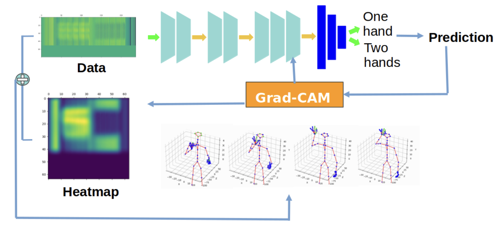

# 🌌 Projet Cassiopée

[](https://arxiv.org/abs/2406.12440)

## 🖐 Self-supervised learning with deep neural networks for automatic gesture recognition
Gesture is an important means of non-verbal communication that facilitates many human interactions in different contexts, including driving or communicating with disabled people. It is therefore essential to acquire the ability to automatically recognise this means of communication in order to improve human-computer interactions.

Current progress in the development of automatic recognition of human gestures has accelerated but is hampered by the costly human annotation required to establish the necessary dataset. One solution to this problem is to use self-supervised learning, which extends the learning process applied to unlabelled data. This methodology has been widely applied to several other computer vision tasks, but its application to gesture recognition, particularly in a multimodal context, is still limited.

## Usage

### Overview

1. Description
- **documentation** contains the poster, the report of the project and other documents related to the project
- **demonstration** contains the necessary files to run an interactive hand gesture demonstration (training a model is required)
- **data** contains the datasets used (mocaplab data not available publicly)
- **src** contains all the code used for the expirements

1. Running
- Train all three supervised models: *src/models/mocaplab/full_train.py*
- Train self-supervised CNN: *src/models/mocaplab/ssl_train.py*
- Visualize the classifications of the models: *src/models/mocaplab/classification_visu.py*
- Plot Grad-CAM visualization skeletons: *src/visualisation/plot_points_color.py*

### Guide

## Method

1. Working on professional high-quality motion capture data provided by Mocaplab


2. Three deep learning models in supervised settings: Fully Connected (FC), CNN and LSTM

3. A self-supervised learning approach for CNN


4. Explainability: Grad-CAM visualisation



## Results

1. Deep learning methods are very powerful for gesture recognition

2. Self-supervised learning leverages small amount of labelled data for better results than supervised learning

3. Limitations and perspectives
- Binary classification is an "easy" task on which simple models can excel 
- Explaining the prediction for two hands signs needs further investigation  
- Extend to multiple categories data and consider larger volumes of (multimodal) data


## Example of Interface for Demonstration

## Cite

[Research paper:](https://arxiv.org/abs/2406.12440)

```
@misc{allemand2024deep,
      title={Deep self-supervised learning with visualisation for automatic gesture recognition}, 
      author={Fabien Allemand and Alessio Mazzela and Jun Villette and Decky Aspandi and Titus Zaharia},
      year={2024},
      eprint={2406.12440},
      archivePrefix={arXiv},
      primaryClass={id='cs.CV' full_name='Computer Vision and Pattern Recognition' is_active=True alt_name=None in_archive='cs' is_general=False description='Covers image processing, computer vision, pattern recognition, and scene understanding. Roughly includes material in ACM Subject Classes I.2.10, I.4, and I.5.'}
}
```

## 👥 Team
- ALLEMAND Fabien
- MAZZELLA Alessio
- VILLETTE Jun

